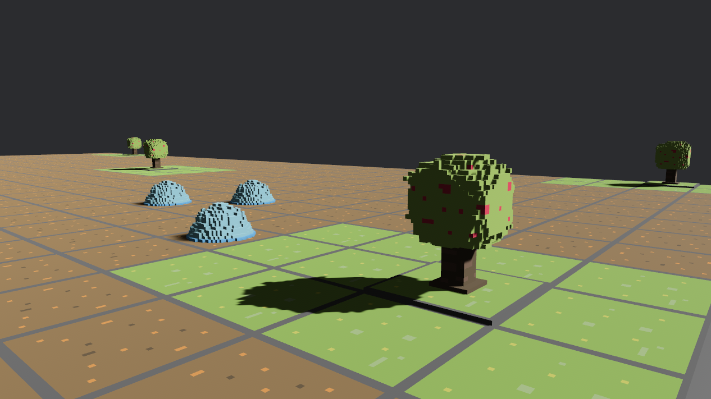

# Slimes World

> TODO，草稿，这个游戏大概率咕咕咕，看看能做多少叭

## 1. Features

* Preview
  * 
* 摄像机控制：WASDQE移动、鼠标右键旋转视角

## 2. 游戏设计

* 一个RTS、Single-Player、3D游戏
  * 以编程的方式控制单位
  * 模仿Screeps: World，但是一个简化版本
  * 体素风格
* 有存档功能，可以关闭后继续游玩

## 3. 游戏元素/实体

* 地图
  * 单个地图，地图是长方体，由map_width * map_height个方块组成，每个方块是一个单位
  * 每个方块可以是以下类型
    * 可移动的
      * dirt、grass、sand、bush
    * 障碍物
      * wall、rock、tree、water、building (home)
* 史莱姆
  * 因为我很喜欢史莱姆，所以每个单位都是史莱姆
  * 史莱姆需要进食，史莱姆什么都可以吃，不同食物有不同的效果
    * 草：增加生命值
      * Normal Mode
      * Realistic Mode：生命值随时间减少
    * 浆果：大幅增加生命值
    * 特殊史莱姆核心：获得新的模组
  * 史莱姆核心
    * 每个史莱姆都初始拥有一个史莱姆核心
    * 史莱姆可以通过杀死其他史莱姆，来增加自己的核心数量（或者繁殖）
  * 特殊史莱姆核心
    * 一些Boss或者特殊史莱姆会掉落特殊史莱姆核心
    * *特殊史莱姆核心* 可以用于让史莱姆获得新的模组，比如新的攻击方式、移动方式、生存方式等
    * *特殊史莱姆核心* 有几类模式，可以相互兼容
      * 第一类，每次update都会调用对应的核心方法，修改史莱姆的属性
      * 第二类，AI编程时主动触发核心方法，实现一些特殊的效果
* 建筑物
  * 家
    * 家可以容纳一定数量的史莱姆居住（人口上限）
  * 圣泉（Sacred Spring）
    * 圣泉会生产史莱姆核心
  * 墙
    * 障碍物
* 势力
  * 每个势力 = 一个AI

## 4. 编码约定

* 随缘，说不定某个时刻就重构了
* ECS架构
  * 关于Component中的方法：目前将极其简单的方法放在Component中，例如`new`等几乎不包含任何逻辑的方法